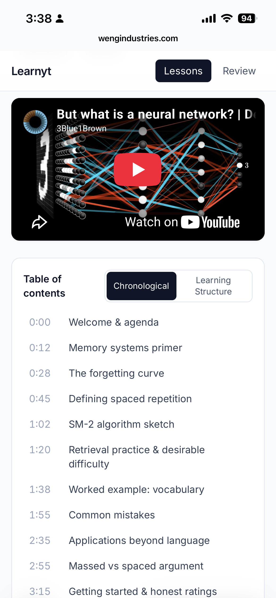
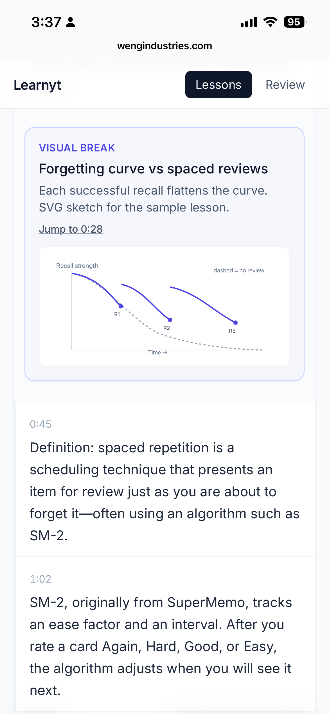

# Learnyt (youtube-learner)


<a target="_blank" href="https://github.com/Siphon880gh" rel="nofollow"></a>
<a target="_blank" href="https://www.linkedin.com/in/weng-fung/" rel="nofollow"></a>
<a target="_blank" href="https://www.youtube.com/@WengTeachesCode/" rel="nofollow"></a>

By Weng (Weng Fei Fung). Generate transcripts, lessons, spaced repetition, infographics/diagrams for any Youtube video where learning is important.

**Why is this not automatic.** Weng provides this service for free and cannot cover the ongoing cost of AI tokens. That's why this Prompt Builder is designed to let users supply their own AI processing resources rather than having the app pay for them. This is also why AI processing isn't integrated directly into the app for a more seamless experience.

There are several ways to accomplish this:

1. **Copy the generated prompt into ChatGPT or Claude:** Users can use their existing AI subscriptions to process the prompt.
2. **Copy the generated prompt into an AI harness like Cursor or Claude Code:** Users can leverage their own AI coding environments and available token allowances.
3. **Provide their own API key:** The app could process prompts directly using the user's API key, with usage billed to the user. However, this requires trusting that the app does not store, log, or copy the key. This is generally easier to verify with a locally running application or a Chrome extension, although neither is inherently secure without reviewing how it handles credentials.

**For now, letting you use your own AI tools is the most practical approach.** It keeps the service free while allowing you to use AI resources you already have access to. This app uses the method best suited to its particular workflow.

If the service eventually becomes commercial and can sustain the cost of AI tokens, AI processing could be integrated directly into the app for a more seamless experience. **This app uses harness-first.**

Harness-first **YouTube → interactive learning modules**.

You do **not** submit URLs through a web form. Open this project in an AI coding harness (Cursor, Claude Code, etc.), paste a YouTube URL in chat, and the local skill under `.agents/skills/youtube-lesson/` fetches the transcript, builds dual TOCs, diagrams/infographics, and writes lesson JSON. This PHP app renders lessons with highlights, deep links, visual breaks, and spaced repetition.


## Screenshots

Automatic table of contents next to the video:



Automatic diagrams as visual breaks in the transcript:



## Quick start

```bash
cd /path/to/learnyt
cp .env.example .env          # optional tweaks
php -S localhost:8080
```

Open http://localhost:8080 — a sample lesson is included so the UI is demoable immediately.

Requirements: **PHP 7.4+** (works with MAMP 7.4; polyfills for PHP 8 string helpers). Optional for the skill: **yt-dlp** on PATH (Homebrew: `brew install yt-dlp`).


## Dual storage (browser → Sync to demo)

1. **Seed** — `data/lessons/sample-spaced-rep.json` is committed and always listed (badge: Sample).
2. **Import** — paste/upload lesson JSON on the home page into **localStorage** (`learnyt_user_lessons_v1`). Badge: On this browser. Cannot overwrite the seed id.
3. **Sync to demo** — button prompts for a password. PHP validates `SYNC_DEMO_PASSWORD` from `.env` (local demo password: **`go`**). On success, writes gitignored `data/demo/lessons/{id}.json` (plus highlights/SRS under `data/demo/`). Badge: Synced demo. **Any visitor of this app URL can open synced lessons.** Wrong password: no files written.
4. Seed folder `data/lessons/` is never written by sync.

Set in `.env` (gitignored):

```
SYNC_DEMO_PASSWORD=go
```

## Harness workflow (6 steps)

1. Open this folder in an AI coding harness with local tools.
2. Paste a YouTube URL in chat; ask to run the **youtube-lesson** skill.
3. Skill fetches timestamped transcript (yt-dlp / `php api/transcript_helper.php`).
4. Skill segments content, builds chronological + learning TOCs, and adds Mermaid/SVG diagrams where visuals help.
5. Skill writes `data/lessons/{videoId}.json`.
6. Refresh Lessons → study, highlight, deep-link, browse diagrams, save to SRS.

Skill instructions: [`.agents/skills/youtube-lesson/SKILL.md`](.agents/skills/youtube-lesson/SKILL.md)  
Schema: [`docs/DATA_SCHEMA.md`](docs/DATA_SCHEMA.md)

## App pages

| Page | Role |
|------|------|
| `index.php` | Landing, workflow, lesson list |
| `lesson.php?v=` | Dual TOC, video, transcript, diagrams, highlights |
| `review.php` | SRS queue (Again / Hard / Good / Easy) |
| `api/*.php` | Highlights, SRS, lessons JSON APIs |

## Dual TOC

- **Chronological** — video order with timestamps and deep links  
- **Learning Structure** — study order (concepts, definitions, examples, …) linking back to source times  

Toggle on the lesson page (`?toc=chrono|learn`).

## Diagrams / infographics

Lessons include a `diagrams` array. The **youtube-lesson skill should emit Mermaid** (`kind: "mermaid"`) visual breaks attached to transcript segments whenever a concept can be illustrated (SVG/image also work). In the UI:

- Diagrams appear as **inline visual breaks** in the transcript at the linked segment/time
- A **Diagrams** gallery lists all visuals; each jumps to the transcript + video timestamp
- Deep link: `lesson.php?v=VIDEO_ID&dg=d1&t=62`

## Highlights & SRS

- Highlights: `data/highlights/{videoId}.json` via selection toolbar  
- SRS: `data/srs.json`, SM-2-inspired intervals  
- Local only; highlight/SRS write files are gitignored  

## Secrets

- Use `.env` for any server-side config (see `.env.example`)  
- **Never** put API keys in frontend JS, HTML, CSS, query params, or committed files  
- `.env` is gitignored  

## Transcript helper (CLI)

```bash
php api/transcript_helper.php VIDEO_ID
php api/transcript_helper.php --url 'https://www.youtube.com/watch?v=VIDEO_ID'
```

Web access to this script is blocked (CLI only).

## Design notes

Plain PHP 7.4+, Tailwind CDN, vanilla JS, Mermaid CDN for diagrams. Zero Composer deps by default. Neutral slate palette, Inter/system fonts, readable max width.

## License

Use freely for local learning tools. YouTube content remains subject to YouTube’s terms; this app stores lesson JSON you generate locally.
